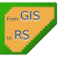
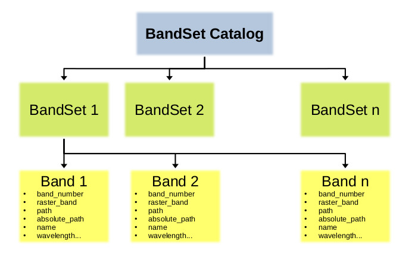
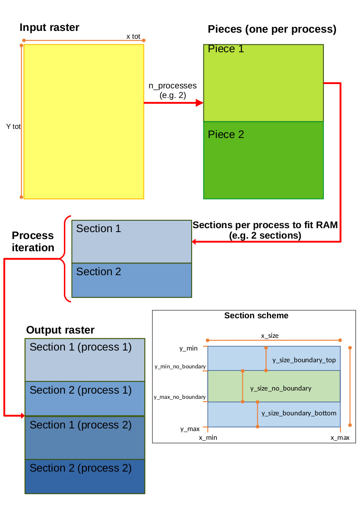

.. |br| raw:: html

     

Introduction
===========================================

|logo| Remotior Sensus, developed by Luca Congedo, is a Python package that allows
for the processing of remote sensing images and GIS data.

The main objective is to simplify the processing of remote sensing data
through practical and integrated APIs that span from the download and
preprocessing of satellite images to the postprocessing of classifications
and GIS data.
Basic dependencies are `NumPy <https://numpy.org>`_,
`SciPy <https://scipy.org>`_ for calculations, and `GDAL <https://gdal.org/>`_
for managing spatial data.

The main features are:

- **Search and Download** of remote sensing data such as Landsat and Sentinel-2.
- **Preprocessing** of several products such as Landsat and Sentinel-2 images.
- **Processing and postprocessing** tools to perform image classification through machine learning, manage GIS data and perform spatial analyses.
- **Parallel processing** available for most processing tools.

``WARNING: Remotior Sensus is still in early development;
new tools are going to be added, tools and APIs may change,
and one may encounter issues and bugs using Remotior Sensus.``

Management of Raster Bands
__________________________

Most tools accept raster bands as input, defined through the file path.

In addition, raster bands can be managed through a catalog of BandSets
(see :meth:`~remotior\_sensus.core.bandset\_catalog`),
where each BandSet is an object that includes information about single bands
(from the file path to the spatial and spectral characteristics).
Bands in a BandSet can be referenced by the properties thereof,
such as order number or center wavelength.

Multiple BandSets can be defined and identified by their reference number.
Therefore, BandSets can be used as input for operations on multiple bands
such as Principal Components Analysis, classification, mosaic,
or band calculation.

In band calculations (see :meth:`~remotior_sensus.tools.band_calc`)
name alias of bands based on center wavelength (e.g. blue, red) can be used
to simplify the structure of calculation expression.

Performance
___________

Most tools are designed to run in parallel processes, through a simple
and effective parallelization approach based on dividing the raster input
in sections that are distributed to available threads, maximizing the use
of available RAM.
This allows even complex algorithms to run in parallel.
Optionally, the output file can be a virtual raster collecting the output
rasters (corresponding to the sections) written independently by parallel
processes; this avoids the time required to produce a unique raster output.
Most tools allow for on the fly reprojection of input data.

Machine Learning
________________

Remotior Sensus optional dependencies are `PyTorch <https://pytorch.org/>`_
and `scikit-learn <https://scikit-learn.org/stable/>`_, which are
integrated in the tool :meth:`~remotior\_sensus.tools.band\_classification`
to allow for land cover classification through machine learning.
The aim is to simplify the training process and development of the model.

Source Code
___________

The source code of Remotior Sensus is available
at https://github.com/semiautomaticgit/remotior_sensus .

To report issues please visit
https://github.com/semiautomaticgit/remotior_sensus/issues .

License of Remotior Sensus
''''''''''''''''''''''''''
Remotior Sensus is free software: you can redistribute it and/or modify it
under the terms of the GNU General Public License as published by
the Free Software Foundation, either version 3 of the License,
or (at your option) any later version.
Remotior Sensus is distributed in the hope that it will be useful,
but WITHOUT ANY WARRANTY; without even the implied warranty
of MERCHANTABILITY or FITNESS FOR A PARTICULAR PURPOSE.
See the GNU General Public License for more details.
You should have received a copy of the GNU General Public License
along with Remotior Sensus. If not, see https://www.gnu.org/licenses/.

How to cite
__________________________

Congedo, Luca, (2023). Remotior Sensus. https://github.com/semiautomaticgit/remotior_sensus

Official site
_____________

For more information and tutorials visit the official site

    |fromGIStoRS| `From GIS to Remote Sensing
    <https://fromgistors.blogspot.com/p/remotior-sensus.html>`_

